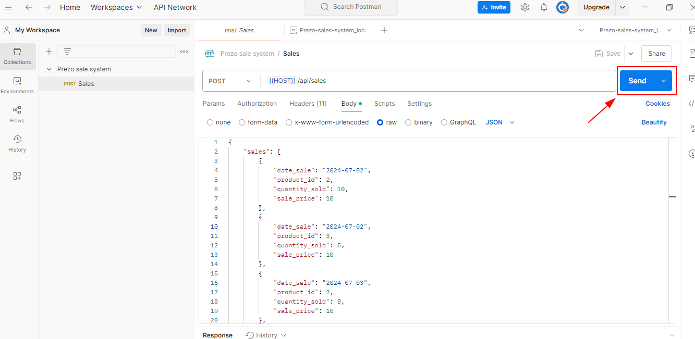

# Prezo Sale System

## Descripción
Este proyecto gestiona las ventas de un restaurante, incluyendo la creación de ventas, el cálculo de márgenes de beneficio y la identificación de los días con mayor y menor volumen de ventas.

## Requisitos del sistema
Antes de comenzar, asegúrate de tener instalado lo siguiente:

### Sistema Operativo
- **Windows** Se recomienda la version 10.

## Requisitos adicionales
- PHP >= 8.0
- Laravel >= 11.0
- Composer
- SQLite
- Postman

## Instalación

1. Instala las dependencias:
    ```bash
    composer install
    ```

2. Configura el archivo `.env` para la base de datos SQLite:
    ```ini
    DB_CONNECTION=sqlite
    DB_DATABASE=./database/database.sqlite
    ```

3. Ejecuta las migraciones para crear la base de datos:
    ```bash
    php artisan migrate
    ```

4. Rellena la base de datos:
    ```bash
    php artisan db:seed
    ```

    O usa:

    ```bash
    php artisan db:seed --class=ProductsSeeder
    ```

    **Nota:** Para acceder a la base de datos, ejecuta:

    ```bash
    sqlite3 database/database.sqlite
    ```

5. Levanta el servidor de Laravel:
    ```bash
    php artisan serve
    ```

    Esto debería mostrar algo similar. Ten en cuenta que la URL local puede variar:

    

6. Importa la colección de Postman y el entorno:

    Abre Postman, haz clic en `Import` y selecciona los archivos `Prezo-sale-system.postman_collection.json` y `Prezo-sales-system_local.postman_environment.json` que se encuentran en la ruta `app\postman_exports`.

    

    **Nota:** Asegúrate de que el valor de la variable del entorno sea la URL en la que se ha iniciado el servidor.

    
        
    

## Guía de uso

Para realizar el cálculo del margen de beneficio de cada escandallo y determinar el día con mayor y menor volumen de ventas, necesitamos ejecutar la petición `Sales` en Postman.

1. En Postman, selecciona `Sales`, y en la sección de Body, introduce un **JSON** con la siguiente estructura:

```JSON
{
    "sales": [
        {
            "date_sale": "2024-07-02",
            "product_id": 2,
            "quantity_sold": 10,
            "sale_price": 10
        },
        {
            "date_sale": "2024-07-02",
            "product_id": 3,
            "quantity_sold": 5,
            "sale_price": 10
        },
        {
            "date_sale": "2024-07-03",
            "product_id": 2,
            "quantity_sold": 8,
            "sale_price": 10
        },
        {
            "date_sale": "2024-07-03",
            "product_id": 3,
            "quantity_sold": 2,
            "sale_price": 8
        }
    ]
}
```


&nbsp;

Después de introducir los valores, haz clic en `Send`.
Podrás observar un resultado como este:



&nbsp;

Podremos observar un resultado como este:

